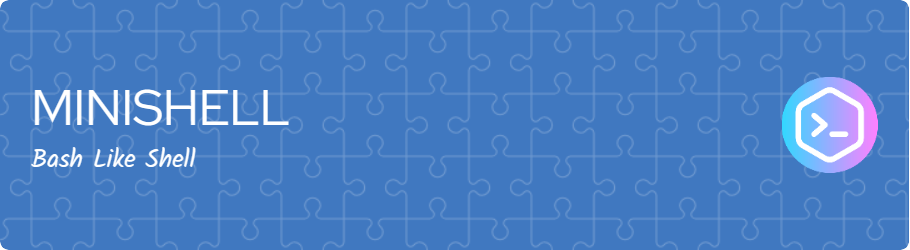

# Minishell

Minishell is a simple shell program written in C that emulates a basic command-line interface. It supports executing commands, handling built-in commands, managing environment variables, implementing redirections, handling pipes, and more. Please note that Minishell was tested only on macOS.

## Features
- Display a prompt with the current directory.
- Command history support.
- Search and launch the right executable based on the PATH variable or using a relative or absolute path.
- Handle single quotes ('), preventing interpretation of env variables within the quoted sequence.
- Handle double quotes (").
- Implement input and output redirections using '<', '>', '>>', and '<<'.
- Support command pipelines using the '|' character.
- Expand environment variables (sequences starting with '$') to their values.
- Handle special variables like '$?' to expand to the exit status of the most recently executed foreground pipeline.
- Handle signals: ctrl-C, ctrl-D, and ctrl-\ with expected behaviors.
- Implement built-in commands: echo, cd, pwd, export, unset, env, and exit.
## Prerequisites
To compile and run Minishell on your machine, you need to have the following dependencies installed:

- GCC (GNU Compiler Collection)
- Make
- Readline library
## Installation
1. Clone the repository to your local machine.
2. Navigate to the project directory.
3. Run the make command to compile the Minishell program.
```bash
$ git clone <repository-url>
$ cd minishell
$ make
```
## Usage
Once you have compiled Minishell, you can run the generated executable file. Here are some examples of using Minishell:

```bash
$ ./minishell
$ ls -l
$ echo "Hello, World!" | grep "Hello"
$ cd path/to/directory
$ export KEY=value
$ unset KEY
$ env
$ exit
```
Minishell provides a basic command-line interface similar to other shells. You can enter commands interactively and use various features like command history, redirections, pipes, and built-in commands.

# Known Limitations
- Minishell was tested only on macOS and may have compatibility issues on other operating systems.
